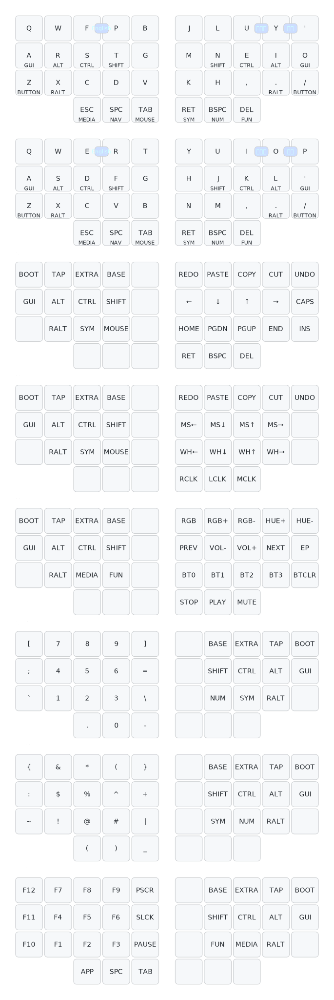

# Cornix용 Miryoku 레이아웃

Cornix 키보드에 적용된 [Miryoku](https://github.com/manna-harbour/miryoku) 레이아웃 설정입니다.

[English Documentation](./README.md)

## 키맵 시각화



> 키맵 이미지는 [Keymap Drawer](https://github.com/caksoylar/keymap-drawer)를 통해 커밋할 때마다 자동 생성됩니다.

## 현재 설정

### 기본 레이아웃
- **알파벳**: Colemak-DH (BASE 레이어)
- **보조 알파벳**: QWERTY (EXTRA 레이어)
- **네비게이션**: VI 스타일 (H J K L)
- **클립보드**: macOS (Cmd+C/V/X/Z)

### 레이어 구조
| 레이어 | 번호 | 설명 |
|--------|------|------|
| BASE | 0 | Colemak-DH + 홈로우 모드 |
| EXTRA | 1 | QWERTY (한글/일본어용) |
| TAP | 2 | 모디파이어 없는 알파벳 (게임용) |
| BUTTON | 3 | 마우스 버튼 + 클립보드 |
| NAV | 4 | 네비게이션 + 편집 |
| MOUSE | 5 | 마우스 커서 + 스크롤 |
| MEDIA | 6 | 미디어 + 블루투스 |
| NUM | 7 | 숫자패드 |
| SYM | 8 | 심볼 |
| FUN | 9 | 펑션 키 (F1-F12) |

## 언어 전환 콤보

Karabiner-Elements와 연동하여 언어별 자동 레이어 전환을 지원합니다.

| 콤보 | 입력 소스 | 레이어 | 키보드 배열 |
|------|----------|--------|------------|
| R+S | 영어 | BASE | Colemak-DH |
| E+I | 한국어 | EXTRA | QWERTY |
| N+E | 일본어 (히라가나) | EXTRA | QWERTY |

### Colemak-DH 홈로우 위치
```
왼손: A   R   S   T   (G)
오른손: (M)  N   E   I   O
```

## 홈로우 모드 설정

| 설정 | 값 | 설명 |
|------|-----|------|
| `tapping-term-ms` | 200ms | 홀드 인식 시간 |
| `require-prior-idle-ms` | 150ms | 빠른 타이핑 시 오탐 방지 |
| `flavor` | tap-preferred | 탭 우선 인식 |
| `quick-tap-ms` | 200ms | 레이어 키 연속 입력 허용 |

## 마우스 설정

| 설정 | 값 | 설명 |
|------|-----|------|
| 이동 속도 | 2500 | 기본 대비 2배 |
| 스크롤 속도 | 200 | 기본 대비 2배 |
| 이동 가속 | 2 | 누를수록 빨라짐 |

## 파일 구조

```
config/miryoku/
├── custom_config.h          # 사용자 설정 (레이아웃, 네비게이션 등)
├── mapping/
│   └── cornix.h             # Cornix 50키 → Miryoku 36키 매핑
├── miryoku.dtsi             # 메인 키맵 정의
├── miryoku.h                # 공통 매크로 및 상수
├── miryoku_behaviors.dtsi   # 홈로우 모드 동작 정의
├── miryoku_combos.dtsi      # 언어 전환 콤보
├── miryoku_mousekeys.h      # 마우스 속도 설정
├── miryoku_mousekeys.dtsi   # 마우스 키 동작
└── miryoku_babel/           # 레이어 정의 (자동 생성)
```

## 커스터마이징

### 레이아웃 변경
`custom_config.h`에서 설정:
```c
// QWERTY로 변경
#define MIRYOKU_ALPHAS_QWERTY

// VI 네비게이션 비활성화 (기본 네비게이션 사용)
// #define MIRYOKU_NAV_VI
```

### 마우스 속도 조정
`miryoku_mousekeys.h`에서 설정:
```c
#define ZMK_POINTING_DEFAULT_MOVE_VAL 2500  // 이동 속도
#define ZMK_POINTING_DEFAULT_SCRL_VAL 200   // 스크롤 속도
#define U_MOUSE_MOVE_EXPONENT 2             // 가속도
```

### 홈로우 타이밍 조정
`miryoku.h`에서 `U_TAPPING_TERM` 값 수정:
```c
#define U_TAPPING_TERM 200  // ms 단위
```

## Karabiner-Elements 설정 (macOS)

언어 전환 콤보가 작동하려면 Karabiner-Elements에 다음 규칙이 필요합니다:

1. 좌측 Command 탭 → `japanese_eisuu` (영어)
2. 우측 Command 탭 → `japanese_kana` (히라가나)
3. `Ctrl+Opt+Space` → 한국어 입력 소스

## 참고 자료

- [Miryoku 공식 문서](https://github.com/manna-harbour/miryoku)
- [ZMK 문서](https://zmk.dev/docs)
- [Karabiner-Elements](https://karabiner-elements.pqrs.org/)
